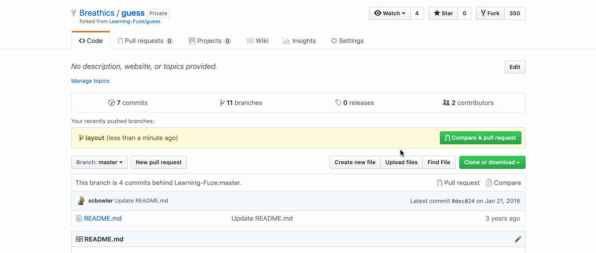

Instructions - Store and Display Inputs
--

### Overview

In this feature, the **HTML** and **CSS** of the calculator skeleton is provided. The first step to have a calculator is being able to have numbers and operators that will be used for calculations. You will have a few goals in this feature: 
1. Storing one single digit number then displaying
2. Storing one double digit number then displaying
3. Storing an operator then displaying
4. Storing an additional number then displaying

- Create a `.js` file.
- Declare the following variables:
  - `storedInput`, assign the value of an empty string `''`.
    - This variable will be used to store an ongoing entry of inputs that will eventually be added into the `Array` of all inputs.
  - `calculatorInputs`, assign the value of an empty array `[]`.
    - This variable will be used to hold all of our inputs that will be used for calculations.
- Declare a function, `displayInputs`.
  - This function will be used to update the calculator display.
- Declare a function, `handleNumbers`.
  - This function will be used to get the `text` value of each number that has been clicked on to then be used as potential numbers for our `calculatorInputs` array.
  - In this function, you may want to use `this` or `event.target` to get the direct reference of the number element that triggered the event.
  - Get the `text` of that number clicked and concatenate that value to the `storedInput` variable.
- Add a click event handler to the numbers.
  - This click handler will use the `handleNumbers` function
- Declare a function, `handleOperators`.
  - This function will be used to get the `text` value of each operator that has been clicked on to then be used as a potential operator for our `calculatorInputs` array.
  - In this function, you may want to use `this` or `event.target` to get the direct reference of the operator element that triggered the event.
  - Get the `text` of that operator clicked and concatenate that value to the `storedInput` variable.
- Add a click event handler to the numbers.
  - This click handler will use the `handleOperators` function
- Each of the functions `handleNumbers` and `handleOperators` will call the `displayInputs` function to update the display as the user is clicking on the number and operator buttons on the calculator.

### Design Docs

### After Each Feature

- When your feature implementation is complete, you will want to save and submit your work to the branch that you have created.
  - Use `git status` to check that you are on the correct branch that represents your feature.
  - You will want to **add**, **commit**, and **push** the code that you have written to the appropriate Github repository.
    1. `git add .`
    2. `git commit -m "Description of the feature that you have implemented"`
       - e.g. `git commit -m "Added inputs to be used for calculations"`
    3. `git push origin FEATURE_NAME_HERE`
       - e.g. `git push origin handlingInputs`

- Finally, you will want to create a pull request. This will merge the code from your newly **completed** feature branch into your `master` branch.

  1. Navigate to <kbd>New Pull Request</kbd>:
  
  2. Compare changes to merge:
  
  3. Create a new pull request:
  
  4. Merge pull request:
  
  5. Update master with the new changes:
  
  6. Go back to [Features](../../README.md#features), if you're still working through the project.
